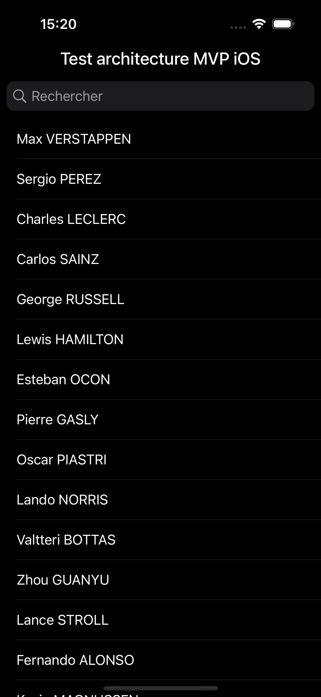
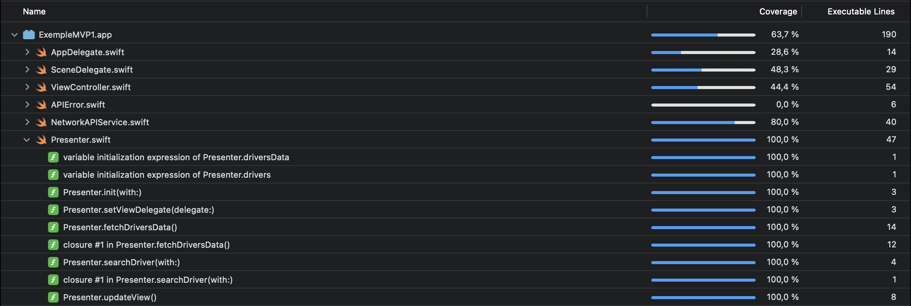

# iOS (Swift 5): Test MVP avec UIKit

L'architecture **MVP** est une des architectures utilisées dans le développement iOS, mais peu populaire en entreprise. Ici, voici un exemple simple où j'implémente l'architecture **MVP** avec **UIKit**. Je propose également des tests unitaires pour démontrer la testabilité de l'application.

## Plan de navigation
- [Architecture MVP](#mvp)
    + [Définition](#definition)
    + [Spécificités iOS](#specificity)
    + [Avantage et inconvénients](#specificity)
- [Exemple](#example)
    + [Cas pratique](#practice)
    + [Testabilité](#tests)

## <a name="mvp"></a>Architecture MVP

### <a name="definition"></a>Définition

L'architecture **MVP** (**Model View Presenter**) est un design pattern qui permet de séparer la logique métier et les interactions de l'interface utilisateur (UI). Cette architecture se compose en 3 éléments:
- Le **modèle (Model)** représente les différents modèles de données de l'application.
- La **vue (View)** représente l'UI (interface graphique) et les interactions utilisateurs (appui sur un bouton, saisie de texte, ...).
- La **présentation (Presenter)** est l'intermédiaire entre la vue et le modèle. Ses responsabilités sont de réagir aux actions de l'utilisateur, de gérer la logique métier (ici, récupérer les données du modèle) et de formater ces données pour la vue en charge de les afficher.

Particularité du **MVP**, la vue a une référence avec la présentation et la présentation ayant une référence avec la vue. La vue ne connait donc plus le modèle, c'est maintenant la présentation qui a une référence avec le modèle.

**ATTENTION: NE PAS CONFONDRE AVEC LA STRATÉGIE DE DÉVELOPPEMENT DE PRODUIT AYANT LE MÊME ACRONYME MVP, SIGNIFIANT ICI Minimum Viable Product.**

<br>

### <a name="specificity"></a>Spécificités iOS pour le MVP

En partant du **MVC**, la vue et le contrôleur (`ViewController`) ne font désormais plus qu'un en **MVP**, ici la vue.<br>

**ATTENTION:** Étant donné que la vue a une référence avec la présentation et que la présentation a une référence avec la vue, il y a donc un cycle de référence entre eux. Par défaut les références sont fortes (`strong`), et dans ce cas, si la vue est détruite, il y a rétention de cycle et donc une fuite de mémoire (**memory leak**). L'une des 2 références du cycle doit être faible (`weak`) afin d'éviter le **memory leak**, et ici ce sera la présentation qui aura une référence faible vers la vue, la vue ayant une référence forte vers la présentation.

Concernant la mise à jour de la vue et du cycle de référence entre la vue et la présentation, le design pattern de la délégation (`delegate`) est utilisé en MVP.

### <a name="advantages"></a>Avantages et inconvénients

Principaux avantages:
- Architecture adaptée pour séparer la vue de la logique métier par le biais de la présentation (**Presenter**).
- `ViewController` allégés.
- Tests facilités de la logique métier (Couverture du code par les tests renforcée), et possibilité d'utiliser des mocks (avec l'**injection de dépendances**) pour tester des services,...

Inconvénients:
- Les `Presenter` peuvent devenir massifs notamment dans des projets de très grande taille. Il est donc difficile de respecter l'ensemble des principes du **SOLID** et particulièrement le premier étant le principe de responsabilité unique (**SRP: Single Responsibility Principle**). La variante **MVP+C** qui utilise un `Coordinator` s'avère utile pour alléger les vues et gérer la navigation entre vues.
- Compréhension et maîtrise compliquée pour les débutants, notamment du fait qu'il y a plusieurs façons de faire pour implémenter cette architecture, menant à des confusions et à des doutes.
- Complexité accrue avec davantage de code.
- Pour les grands projets, les `Presenter` peuvent devenir massifs.
- Gestion des rétentions de cycle.
- Compatibilité complexe avec **SwiftUI**, les vues étant de type valeur (dans des `struct`), le concept ici nécessitant des types références (donc des `classes`).

## <a name="example"></a>Exemple

Voici un exemple d'implémentation avec l'architecture **MVP** où ici l'application va récupérer des données de façon asynchrone depuis une **API REST** et les afficher dans un `TableView`. Ensuite, la possibilité de filtrer la liste avec la barre de recherche.

<br>

### <a name="practice"></a>Cas pratique

#### 1) Présentation (`Presenter`)

Concernant la présentation, 2 composants sont nécessaires: un protocole faisant office de `delegate` et une classe, le `Presenter`.

Le `delegate` avec les méthodes pour la mise à jour de la vue (`ViewController`), c'est la vue qui implémentera les méthodes du protocole, et le `Presenter` qui appelera les méthodes.

```swift
protocol PresenterViewDelegate: AnyObject {
    func didLoadData()
    func didErrorOccured(with errorMessage: String)
}
```

Le `Presenter` fonctionne avec une référence vers la vue, ici le `delegate` pour actualiser la vue. De plus, elle doit être une référence faible étant donné que la vue a une référence forte vers le `Presenter`, d'où l'utilisation de `weak` pour éviter la rétention de cycle.
La méthode `setViewDelegate` va recevoir la référence de la vue.

Pour la testabilité du `Presenter`, une injection de dépendance est utilisée avec le protocole `APIService` pour soit utiliser le service de l'API REST `NetworkAPIService`, soit le mock `MockAPIService` lors des tests.

C'est ainsi que la méthode `updateView()` va déclencher les fonctions déléguées `didLoadData()` et `didErrorOccured()`, une fois l'actualisation des données effectuée avec `fetchDriversData()` et `searchDriver()` (les méthodes de logique métier).

```swift
final class Presenter {
    private var driversData = [Driver]()
    var drivers = [Driver]()
    private var errorMessage: String = ""
    private let apiService: APIService
    
    // Référence avec la vue, attention à la rétention de cycle (memory leak)
    weak private var delegate: PresenterViewDelegate?
    
    // Injection de dépendance pour le mock ou le service réseau
    init(with apiService: APIService) {
        self.apiService = apiService
    }
    
    func setViewDelegate(delegate: PresenterViewDelegate){
        self.delegate = delegate
    }
    
    func fetchDriversData() {
        Task {
            do {
                driversData = try await apiService.fetchDrivers()
                drivers = driversData
            } catch APIError.errorMessage(let message) {
                errorMessage = message
            }
            
            print("Data: \(drivers.count), errorMessage = \(errorMessage)")
            
            await updateView()
        }
    }
    
    func searchDriver(with driverName: String) {
        drivers = driverName.isEmpty ? driversData : driversData.filter { $0.name.lowercased().contains(driverName.lowercased()) }
        delegate?.didLoadData()
    }
    
    // @MainActor remplace DispatchQueue.main.async, mais doit être appelé avec await dans un bloc async.
    // La présentation va ici dire à la vue de se mettre à jour, par le biais de la délégation
    @MainActor private func updateView() {
        guard drivers.count > 0 else {
            delegate?.didErrorOccured(with: errorMessage)
            return
        }
        
        delegate?.didLoadData()
    }
}
```

#### 2) Vue (`ViewController`)

La vue va avoir une référence avec le `Presenter`, ici en injectant à l'initialiseur du `Presenter` une instance de `NetworkAPIService()` pour récupérer les données du réseau.

Dans `viewDidLoad`, on va donner le `ViewController` en référence au `Presenter` avec `self`. Il faut aussi conformer la classe au protocole `PresenterViewDelegate` et implémenter alors dans les fonctions `didLoadData()` et `didErrorOccured()` les actions de mise à jour UI.

Dès lors que les méthodes `fetchDriversData()` et `searchDriver()` sont appelées, le `Presenter` effectue son action de récupération de données et les stocke dans les listes qui lui sont dédiées pour ensuite appeler les méthodes déléguées définies dans l'extension de `ViewController` se conformant au protocole `PresenterViewDelegate`.

```swift
final class ViewController: UIViewController {

    @IBOutlet weak var loadingSpinner: UIActivityIndicatorView!
    @IBOutlet weak var tableView: UITableView!
    @IBOutlet weak var searchBar: UISearchBar!
    
    // Référence circulaire. Forte de la vue avec le présentateur, faible du présentateur vers la vue.
    private lazy var presenter = Presenter(with: NetworkAPIService())
    
    override func viewDidLoad() {
        super.viewDidLoad()
        setViews()
        presenter.setViewDelegate(delegate: self)
        presenter.fetchDriversData()
    }
    
    private func setViews() {
        // ...
    }
    
    private func setSearchBar() {
        // ...
    }
}

// En MVP, la mise à jour se fait avec le pattern de la délégation
extension ViewController: PresenterViewDelegate {
    func didLoadData() {
        loadingSpinner.stopAnimating()
        tableView.reloadData()
        tableView.isHidden = false
    }
    
    func didErrorOccured(with errorMessage: String) {
        let alert = UIAlertController(title: "Erreur", message: errorMessage, preferredStyle: .alert)

        alert.addAction(UIAlertAction(title: "OK", style: .default, handler: { _ in
             print("OK")
        }))

        present(alert, animated: true, completion: nil)
    }
}

extension ViewController: UITableViewDataSource {
    func tableView(_ tableView: UITableView, numberOfRowsInSection section: Int) -> Int {
        return presenter.drivers.count
    }
    
    func tableView(_ tableView: UITableView, cellForRowAt indexPath: IndexPath) -> UITableViewCell {
        let cell = tableView.dequeueReusableCell(withIdentifier: "cell", for: indexPath)
        
        cell.textLabel?.text = presenter.drivers[indexPath.row].name
        
        return cell
    }
}

extension ViewController: UISearchBarDelegate {
    func searchBarTextDidBeginEditing(_ searchBar: UISearchBar) {
        self.searchBar.setShowsCancelButton(true, animated: true) // Afficher le bouton d'annulation
    }
    
    func searchBar(_ searchBar: UISearchBar, textDidChange searchText: String) {
        presenter.searchDriver(with: searchText)
    }
}
```

### <a name="tests"></a>Testabilité

Concernant les tests unitaires, ici on va utiliser la classe de tests exploitant le `Presenter` pour simuler la vue, en y injectant une instance de mock, ici `MockAPIService`. Ne pas oublier de conformer la classe de tests au délégué `PresenterViewDelegate`.

La méthode `fetchDriversData()` du `Presenter` est asynchrone, et nécessite donc dans les différents tests unitaires d'attendre les appels des méthodes déléguées avec des `expectations` pour ensuite vérifier que le `Presenter` ait bien récupéré des données ou ait bien déclenché l'erreur dans les méthodes déléguées avec `fulfillExpectation()`.

```swift
// On considère cette classe comme la vue pour tester la présentation (Presenter)
final class ExempleMVP1Tests: XCTestCase, PresenterViewDelegate {
    var presenter: Presenter!
    var expectation: XCTestExpectation?

    func testData() {
        expectation = expectation(description: "Fetch test data")
        setupFetchTest(error: false)
        
        waitForExpectations(timeout: 5)
        XCTAssertGreaterThan(presenter.drivers.count, 0)
    }
    
    func testFetchError() {
        expectation = expectation(description: "Fetch test error")
        setupFetchTest(error: true)
        
        waitForExpectations(timeout: 5)
        XCTAssertEqual(presenter.drivers.count, 0)
    }
    
    func testSearch() {
        expectation = expectation(description: "Search test")
        setupFetchTest(error: false)
        waitForExpectations(timeout: 5)
        presenter.searchDriver(with: "Lewis HAMILTON")
        XCTAssertEqual(presenter.drivers.count, 1)
    }
    
    private func setupFetchTest(error: Bool = false) {
        presenter = Presenter(with: MockAPIService(mockError: error))
        presenter.drivers.removeAll()
        presenter.setViewDelegate(delegate: self)
        presenter.fetchDriversData()
    }
    
    func didLoadData() {
        print("Vue actualisée")
        fulfillExpectation()
    }
    
    func didErrorOccured(with errorMessage: String) {
        print("Erreur: \(errorMessage)")
        fulfillExpectation()
    }
    
    /*
    Dans le cas d'une fonction déclenchée depuis une fonction asynchrone:
    1) Le test unitaire doit attendre un résultat avec une attente (expectation)
    2) Cette fonction ci-dessous confirme l'attente (méthode fulfill) pour vérifier l'assertion, dans le cas où la synchronisation des données est terminée
    3) Notamment dans le cas de plusieurs tests unitaires avec des attentes, une erreur se déclenche (NSInternalInconsistencyException: "API violation - multiple calls made to -[XCTestExpectation fulfill] for ...") si on ne définit pas la référence de l'expectation à nil.
    */
    private func fulfillExpectation() {
        expectation?.fulfill()
        expectation = nil
    }
}
```

Avec ces tests, la couverture de code (**code coverage**) est renforcée, et dans le cas ci-dessus, les tests couvrent 100% du code du `Presenter`, montrant ainsi que l'ensemble de la logique métier est testée, étant indépendante de la vue.

<br>