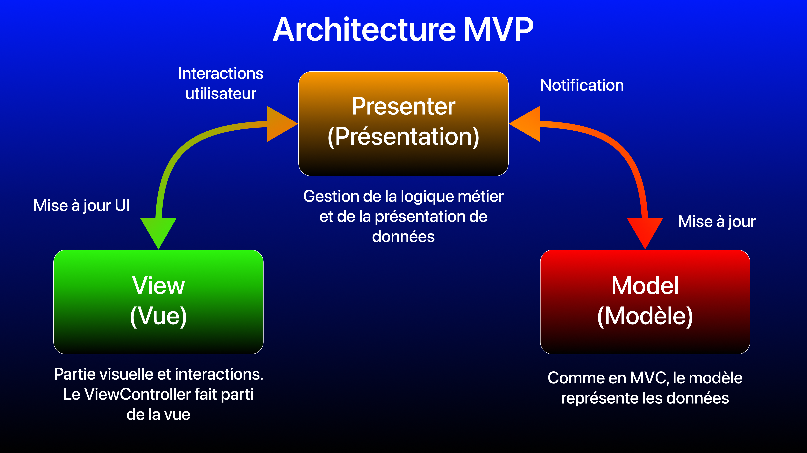

# iOS (Swift 5): Test MVP avec UIKit

L'architecture **MVP** est une des architectures utilisées dans le développement iOS, mais peu populaire en entreprise. Ici, voici un exemple simple où j'implémente l'architecture **MVP** avec **UIKit**.

## Plan de navigation
- [Architecture MVP](#mvp)
- [Exemple](#exemple)

## Architecture MVP

### Définition

L'architecture **MVP** (**Model View Presenter**) est un design pattern qui permet de séparer la logique métier et les interactions de l'interface utilisateur (UI). Cette architecture se compose en 3 éléments:
- Le **modèle (Model)** représente les différents modèles de données de l'application.
- La **vue (View)** représente l'UI (interface graphique) et les interactions utilisateurs (appui sur un bouton, saisie de texte, ...).
- La **présentation (Presenter)** est l'intermédiaire entre la vue et le modèle. Ses responsabilités sont de réagir aux actions de l'utilisateur, de gérer la logique métier (ici, récupérer les données du modèle) et de formater ces données pour la vue en charge de les afficher.

Particularité du **MVP**, la vue a une référence avec la présentation et la présentation ayant une référence avec la vue. La vue ne connait donc plus le modèle, c'est maintenant la présentation qui a une référence avec le modèle.

**ATTENTION: NE PAS CONFONDRE AVEC LA STRATÉGIE DE DÉVELOPPEMENT DE PRODUIT AYANT LE MÊME ACRONYME MVP, SIGNIFIANT ICI Minimum Viable Product.**

 

### Spécificités iOS pour le MVP

En partant du **MVC**, la vue et le contrôleur (`ViewController`) ne font désormais plus qu'un en **MVP**, ici la vue. 

**ATTENTION:** Étant donné que la vue a une référence avec la présentation et que la présentation a une référence avec la vue, il y a donc un cycle de référence entre eux. Par défaut les références sont fortes (`strong`), et dans ce cas, si la vue est détruite, il y a rétention de cycle et donc une fuite de mémoire (**memory leak**). L'une des 2 références du cycle doit être faible (`weak`) afin d'éviter le **memory leak**, et ici ce sera la présentation qui aura une référence faible vers la vue, la vue ayant une référence forte vers la présentation.

Concernant la mise à jour de la vue et du cycle de référence entre la vue et la présentation, le design pattern de la délégation (`delegate`) est utilisé en MVP.

### Avantages et inconvénients

Principaux avantages:
- Architecture adaptée pour séparer la vue de la logique métier par le biais de la présentation (**Presenter**).
- `ViewController` allégés.
- Tests facilités de la logique métier (Couverture du code par les tests renforcée), et possibilité d'utiliser des mocks (avec l'**injection de dépendances**) pour tester des services,...

Inconvénients:

## Exemple